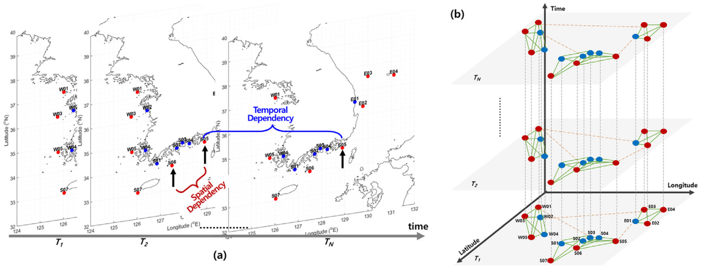

# KIOST-SST-EVL
Extreme Value Loss for Coastal Sea Surface Temperature Forecasting



## Overview
This repository provides code and generated results for coastal sea surface temperature (SST) forecasting using deep time-series models with Extreme Value Loss (EVL). The project focuses on improving the prediction of abnormal high and low SST
events, which are important for marine heatwave monitoring, aquaculture management, and operational ocean forecasting.

The implementation combines two research directions:

* Coastal SST multi-step forecasting using in-situ observation data around the Korean Peninsula
* Extreme value loss (EVL) for improving prediction performance on rare high/low events
* LSTM and Transformer models are used as predictors

## Project directory structure
```
.
├── README.md
├── LICENSE
├── code/
│   └── [Project source code]
└── data/
    └── [Synthetic data]
```

## Project guideline
Any public project SHOULD include:
* MIT License @ `LICENSE`
* Acknowledgement @ `README.md`
* BibTeX citation + link to PDF file @ `README`, if the project is accompanied with a research paper

Any public project SHOULD NOT include:
* Private data, undisclosed data, data with limited accessibility
  - Preferably, *any* data should be hosted outside of the repository.
* Personal information
  - *Unintended* personal information of researchers and developers within source code
  - Device IP address, password, secrets, file path, ...

Any Public project is encouraged to include:
* Project pages (GitHub pages or other platform)
* Examples as Colab/Jupyter notebook


## Dataset
* KMA Weather Data Service 'Open MET Data Portal' (https://data.kma.go.kr/data/sea/selectBuoyRltmList.do?pgmNo=52)
* Ocean Observation - Sea Surface Temperature(SST) (https://cds.climate.copernicus.eu/datasets/satellite-sea-surface-temperature?tab=download)
* Please contact tkkim@kiost.ac.kr for full synthetic data

## Features
- **Model:** Two models of LSTM and Transformer are applied to extreme value analysis. For the extreme value analysis, three methods of data transformation, Frechet and Gumbel extreme distribution loss (Zhang et al.,2021) are applied to two models.  
- **Time-series:** 16 time series of sea surface temperature (SST) around the waters of Korea Peninsula are used and the data can be freely access through KAM Weather Data Service 'Open MET Data Portal'. 
- **Gumbel Generalize Value Loss:** 4 cases of Gumbel distribution function according to the hyper parameter r are applied (r=1.0, 1.1, 1.5, 2.0). 
- **Freceht Generalize Value Loss:** 4 cases of Frechet distribution function according to the hyper parameters of a and s are applied. (a=10 s=1.7, a=13 s=1.7, a=15 s=1.7, a=15 s=2.0)


## Citation
```bibtex
@article{kim2023spatiotemporal,
  title={Spatiotemporal graph neural network for multivariate multi-step ahead time-series forecasting of sea temperature},
  author={Kim, Jinah and Kim, Taekyung and Ryu, Joon-Gyu and Kim, Jaeil},
  journal={Engineering Applications of Artificial Intelligence},
  volume={126},
  pages={106854},
  year={2023},
  publisher={Elsevier}
}

@article{zhang2021enhancing,
  title={Enhancing Time Series Predictors with Generalized Extreme Value Loss},
  author={Zhang, Mi and Ding, Daizong and Pan, Xudong and Yang, Min},
  journal={IEEE Transactions on Knowledge and Data Engineering},
  year={2021},
  publisher={IEEE}
}

@article{kazemi2019time2vec,
  title={Time2vec: Learning a vector representation of time},
  author={Kazemi, Seyed Mehran and Goel, Rishab and Eghbali, Sepehr and Ramanan, Janahan and Sahota, Jaspreet and Thakur, Sanjay and Wu, Stella and Smyth, Cathal and Poupart, Pascal and Brubaker, Marcus},
  journal={arXiv preprint arXiv:1907.05321},
  year={2019}
}

@article{hochreiter1997long,
  title={Long short-term memory},
  author={Hochreiter, Sepp and Schmidhuber, J{\"u}rgen},
  journal={Neural computation},
  volume={9},
  number={8},
  pages={1735--1780},
  year={1997},
  publisher={MIT press}
}

@article{graves2012long,
  title={Long short-term memory},
  author={Graves, Alex and Graves, Alex},
  journal={Supervised sequence labelling with recurrent neural networks},
  pages={37--45},
  year={2012},
  publisher={Springer}
}

@article{vaswani2017attention,
  title={Attention is all you need},
  author={Vaswani, Ashish and Shazeer, Noam and Parmar, Niki and Uszkoreit, Jakob and Jones, Llion and Gomez, Aidan N and Kaiser, {\L}ukasz and Polosukhin, Illia},
  journal={Advances in neural information processing systems},
  volume={30},
  year={2017}
}
```

## Acknowledgement

###### Korean acknowledgement
> 이 논문은 2023년-2026년 정부(과학기술정보통신부)의 재원으로 정보통신기획평가원의 지원을 받아 수행된 연구임 (No.00223446, 목적 맞춤형 합성데이터 생성 및 평가기술 개발)

###### English acknowledgement
> This work was supported by Institute for Information & communications Technology Promotion(IITP) grant funded by the Korea government(MSIT) (No.00223446, Development of object-oriented synthetic data generation and evaluation methods)
